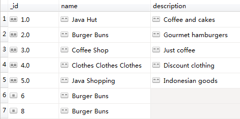

mg-aggregate
======

mg-aggregate：聚合，用于对数据进行提取分析。

> 本指令对应mongodb的操作指令[aggregate](http://mongodb.github.io/mongo-java-driver/3.4/driver/tutorials/aggregation/)

### 实现类

com.alogic.xscript.mongodb.MgAggregate

### 配置参数

支持下列参数：

| 编号 | 代码 | 参数 | 说明  |
| ---- | ---- | ---- | ---- |
| 1 | db | 自定义 |连接的数据库名，位于mg-db标签|
| 2 | table | 自定义 |操作的集合名，位于mg-table标签|
| 3 | tagValue | 自定义 |返回的标志|
| 4 | doc | bson形式的文档 |聚合框架，按一定规定的key-value组合|

#### doc写法规范
聚合框架下的操作包括match，projection，group，sort，limit，skip，unwind等
> doc写法 [{操作1},{操作2},{操作3}...]，操作间可以任意组合，各操作的说明与规范如下：

| 编号 | 代码 | 参数 | 说明  | 写法 |
| ---- | ---- | ---- | ---- | ---- |
| 1 | $match| filter子标签 |用于过滤文档|{$match:{query}}，query参考filter格式|
| 2 | $projection | 自定义字段 |提取、重命名、新增字段|{$project:{<field>:1或0或名称}}，1表示提取该字段，0表示排除该字段，"名称"表示修改该字段或者新增不存在的字段，默认返回_id字段.[详细参考](https://docs.mongodb.com/manual/reference/operator/aggregation/project/)|
| 3 | group | 自定义bson |分组|{ $group:{_id:<expression>,<field1>:{<accumulator1>: <expression1>},...}，其中<expression>指定要操作的字段，可以是多个，<field1>是自定义的，<accumulator>包括 sum,avg,first,last,max,min,push,addToSet,stdDevPop,stdDevSamp.[详细参考](https://docs.mongodb.com/manual/reference/operator/aggregation/group/)|
| 4 | sort |自定义bson|对指定字段排序|{$sort:{<field1>:1或-1,<field2>:1或-1,<field3>:1或-1...}},1表示正排序，-1表示逆排序|
| 5 | limit | 自定义 |返回文档的数量|{$limit:整数值}|
| 6 | skip | 自定义 |跳过文档的数量|{$skip:整数值}|
| 7 | unwind | 自定义 |拆分数组|{$unwind:数组名}|
### 案例

实验在数据库test，集合stores上进行测试，测试数据如下：



> 聚合条件：统计字段为name，计算每个name值出现的次数

输出结果：
```
{
    "data": [
        {
            "_id": "Java Hut", 
            "count": 1
        }, 
        {
            "_id": "Burger Buns", 
            "count": 3
        }, 
        {
            "_id": "Clothes Clothes Clothes", 
            "count": 1
        }, 
        {
            "_id": "Coffee Shop", 
            "count": 1
        }, 
        {
            "_id": "Java Shopping", 
            "count": 1
        }
    ]
}
```
#### 实现

具体实现代码如下：
```
<?xml version="1.0"?>
<script>
	<using xmlTag = "mg-cli" module="com.alogic.xscript.mongodb.MgClient"/>
	<mg-cli cli="globalMongoDBClientPool">
		<mg-db db="test">
			<mg-table table="stores" >
				<mg-aggregate tag="data" 
				doc="[{&quot;$group&quot;:{&quot;_id&quot;:&quot;$name&quot;,&quot;count&quot;:{&quot;$sum&quot;:1}}}]">
				</mg-aggregate>
			</mg-table>
		</mg-db>
	</mg-cli>
</script> 

```